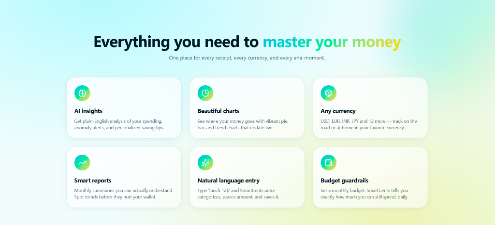
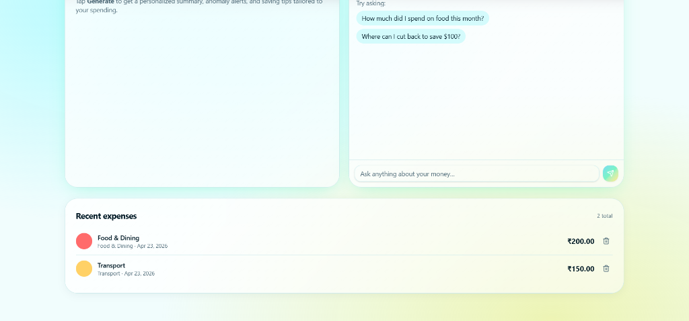
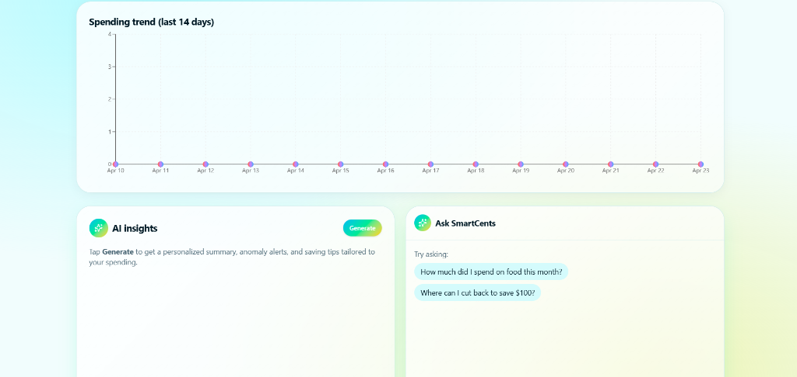

# SmartCents


SmartCents is a premium, AI-powered personal finance and expense tracking application built using the MERN stack (MongoDB, Express, React, Node.js). It empowers users to take control of their finances with multi-currency support, dynamic charts, and natural language AI insights.

## Features



* **AI-Powered Insights:** Get plain-English analysis of your spending, anomaly alerts, and personalized saving tips powered by your choice of AI (OpenAI or Gemini).
* **Multi-Currency Support:** Track expenses in USD, EUR, INR, JPY, and more, making it perfect for both local management and international travel.
* **Beautiful Real-Time Charts:** Visualize your spending patterns with interactive pie charts, bar charts, and trend lines that update instantly.
* **Modern Interface:** Experience a high-energy, vibrant UI featuring glassmorphism design, smooth micro-animations, and responsive layouts.
* **Smart Budgeting:** Set a monthly budget and let SmartCents tell you exactly how much you can spend per day to stay on track.

## App Interface






## Tech Stack

* **Frontend:** React, Vite, Tailwind CSS, Shadcn UI
* **Backend:** Node.js, Express.js
* **Database:** MongoDB
* **AI Integrations:** Google Gemini / OpenAI (configurable)

## Getting Started

### Prerequisites

* Node.js (v18 or higher)
* MongoDB database
* A Gemini or OpenAI API Key

### Installation

1. **Clone the repository:**
   ```bash
   git clone https://github.com/ayush6077/Smart_Expense_Trackerr.git
   cd Smart_Expense_Trackerr
   ```

2. **Setup the Backend:**
   ```bash
   cd backend
   npm install
   ```
   Create a `.env` file in the `backend` directory based on the following:
   ```env
   PORT=5000
   MONGO_URI=your_mongodb_connection_string
   JWT_SECRET=your_jwt_secret
   
   # Provide an API key for your chosen AI Provider
   OPENAI_API_KEY=your_openai_api_key
   GEMINI_API_KEY=your_gemini_api_key
   ```
   Start the backend development server:
   ```bash
   npm run dev
   ```

3. **Setup the Frontend:**
   ```bash
   cd ../frontend
   npm install
   ```
   Create a `.env` file in the `frontend` directory:
   ```env
   VITE_API_BASE_URL=http://localhost:5000/api
   ```
   Start the frontend development server:
   ```bash
   npm run dev
   ```

4. Open your browser and navigate to the localhost port provided by Vite!

## License

This project is licensed under the MIT License.
